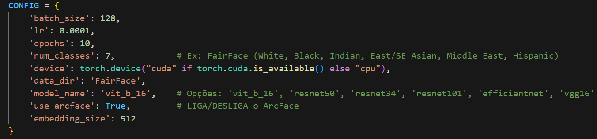
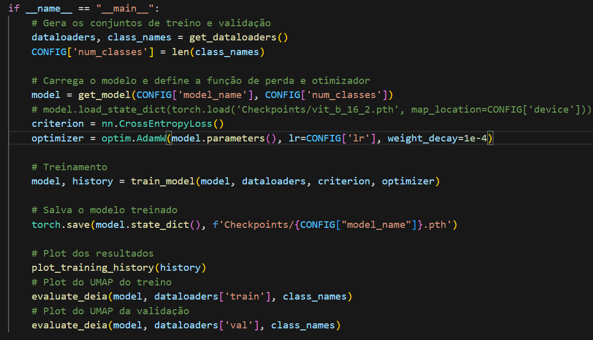
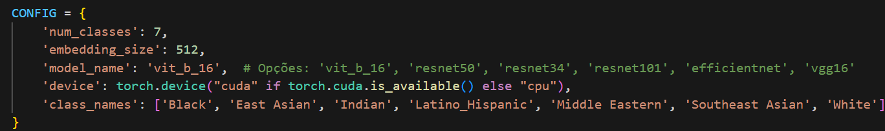
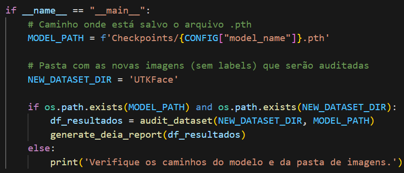
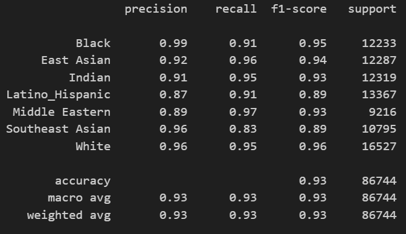
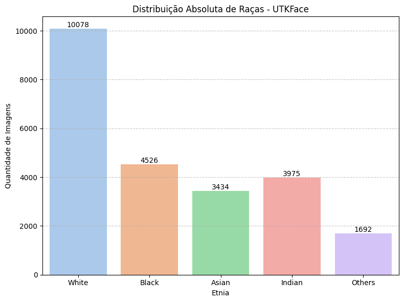

# Aprendizado Profundo - Projeto de Implementação - DEIA

Repositório dedicado ao projeto de implementação da disciplina "Aprendizado Profundo" do Programa de Pós-graduação em Ciência da Computação (PPGCC) da UNESP <https://www.ibilce.unesp.br/#!/pos-graduacao/programas-de-pos-graduacao/ciencia-da-computacao/apresentacao/>, ministrada pelo Prof. Dr. Denis Henrique Pinheiro Salvadeo.

O projeto foi elaborado por Ian Marques Breda e Kaio Henrique Avelino Domeni de Paulo.

## Introdução

Este projeto tem como objetivo implementar uma solução utilizando aprendizado de máquina profundo em um problema envolvendo DEIA (Diversidade, Equidade, Inclusão e Acessibilidade). Para tal, foram desenvolvidos dois códigos: FairFace - Implementation e Subrepresentation Analysis. O primeiro, tem como objetivo o treinamento de diversas redes profundas e o segundo tem como objetivo auditar _datasets_ para detectar sub-representação de etnias, um tema muito recorrente no campo de Aprendizado de Máquina, onde poucas amostras de uma determinada etnia em uma base de dados pode levar o modelo a uma acurácia menor em testes na vida real com essas etnias.

A seguir, serão descritos ambos os códigos e como manipular sua execução.

### FairFace - Implementation

Um código dedicado para o treinamento de 6 redes profundas utilizando o ArcFace para extrair _embeddings_ de uma base de dados conhecida como "FairFace", composta de dois diretórios, um contendo imagens para o treino e outro imagens para a validação, além de dois arquivos CSV que descrevem características das imagens, como idade, gênero e, o que mais nos importa, *raça*. O código é compartimentalizado para que a alteração de funções independentes seja simples e intuitiva e o usuário só precisa se preocupar em alterar duas céluals. A primeira célula contém um dicionário nomeado CONFIG e contém informações relevantes para a execução do _pipeline_ e do treinamento das rede profundas. A imagem abaixo mostra os componentes do dicionário CONFIG:

Como pode ser visto na imagem acima, pode-se modificar coisa como o tamanho do _batch_ do _dataloader_, taxa de aprendizado, quantidade de épocas, o número de classes (caso deseje treinar em outro _dataset_), o dispositivo onde será executado o treinamento, caminho para o diretório do _dataset_, nome do modelo (os modelos disponíveis estão comentados. Mais modelos podem ser adicionados na célula get_model()), se será utilziado o ArcFace (recomendado que sim) e, por fim, o tamanho dos _embeddings_.

Outra célula que pode ser modificada é a _main_, ou principal, que contém todo o _pipeline_ de execução, onde é formado um _dataloader_, um modelo é carregado, treinado conforme os hiperparâmetros do dicionário CONFIG, os _embeddings_ das imagens são extraídos, um plot do histórico de evolução das métricas é elaborado e, por fim, são gerados dois UMAPs, um para o conjunto de treino e outro para o conjunto de validação. UMAP (Uniform Manifold Approximation and Projection) é uma técnica não-linear que cria representações 2D expressivas, enquanto preserva a estrutura local. Ele força uma estrutura geométrica e é ideal para visualizar _clusters_ ou _embeddings_.

A ordem em que a avalição pelo UMAP acontece pode ser alterada ou omitida pelo usuário caso ele deseje, apenas chamando as funções na ordem desejada. A estrutura da _main_ pode ser vista na imagem abaixo:

Após o treinamento do modelo, ele é salvo no formato PTH utilizando o torch.sava. As outras células do código estão devidamente comentadas caso haja necessidade de alteração.

### Subrepresentation Analysis

Este código é a implementação em si. A estrutura é semelhante ao código anterior para ser fácil de compreender. Novamente, temos o dicionário CONFIG da seguinte forma:

O dicionário, novamente, contém o número de classes, que deve ser igual ao número de classes com as quais o modelo foi treinado, o tamanho dos _embeddings_, nome do modelo, dispositivo onde será executado o _pipeline_ e o nome das classes (vale notar que o nome deve aparecer na ordem com a qual o modelo foi treinado no código anterior). Não há muito o que ser alterado pelo usuário além do nome do modelo que realizará a auditoria do _dataset_.

A partir dessas configurações, o código realiza a inferência de uma base de dados sem utilizar suas _labels_, apenas as imagens. Depois que a inferência é realizada pelo modelo, sõa plotados dois gráficos, sendo um para mostrar a frequência absoluta de cada etnia e outro para mostrar a frequência relativa. Um pequeno relatório avaliando a sub-representação aparece em formato de texto informando quais etnias possuem menos amostras do que o ideal. Para considerar um número ideal de amostras, foi considerado $x = 1/número de etnias$ como o valor perfeito, de $x$ até $x/2$ como um valor para se ter atenção e abaixo de $x/2$, um valor de sub-representação crítica. A partir dessas inforamções, o usuário pode decidir como prosseguir, usando técnicas de _data augmentation_ nas classes sub-representadas, excluir caso ache necessário ou não fazer nada. No final da execução do pipeline, é gerado um CSV que é salvo na pasta "Relatórios".

A célula _main_ também está presente neste código e ela se apresenta da seguinte forma:

Na _main_, é definido o caminho até os pesos salvos do modelo escolhido e o caminho para o diretório do _dataset_ que será auditado. Por padrão, deixamos o UTKFace, que também é uma base de dados de diversos rostos cujos nomes das imagens contém inforamações sobre idade, gênero e raça de cada imagem. Como dito anteriormente, o modelo realiza as referências SEM _labels_.

## Diretórios

Este projeto é organizado em 6 diretórios, sendo que os códigos principais ficam fora dos diretóriso junto ao README.

### Checkpoints

O diretório "Checkpoits" contém os modelos salvos no formato PTH. Podem ser utilizados para realização de auditoria ou para validação sem precisar de treinamento no código "FairFace - Implementation".

### FairFace

Contém o _dataset_ FaiFace, utilizado para treinamento dos modelos.

### Imagens

Contém as imagens geradas para a elaboração do README.

### Relatórios

Após a execução do _pipeline_ do Subrepresentation Analysis, é gerado um arquivo CSV contendo o nome do modelo que fez a auditoria. Este relatório pode ser utlizado para uma auditoria manual ou para realizar análises relevantes.

### Resultados

Contém os resultados de cada rede profunda testada, incluindo os UMAPs do treino e validação, o histórico da acurácia e _loss_ no treino e validação e, por fim, os gráficos de auditoria realizados pelo respectivo modelo. Também há uma pasta chamada "UTKFace" que contém a distribuição real de classes do _dataset_.

### UTKFace

Contém o _dataset_ UTKFace, utilizado para que os modelos fizessem as auditorias.

## Testes

No total, foram testadas mais de 24 combinações de redes profundas. Sendo as 6 principais, ResNet34, ResNet50, ResNet101, Efficient Net, VGG-16 e um modelo _transformer_ Vit-B-16. Fizemos testes com eles treianando em ambos os _datasets_ e utilizando ou não o ArcFace como parte do modelo. Cada modelo foi treinado por 10 épocas. Os modelos que utilizaram ArcFace no _dataset_ FairFace se sairam melhores, com destaque para o Vit-B-16 que apresentou resultados satisfatório conforme a imagem dos _embeddings_ extraídos do conjunto de treino (esquerda, classes reais e direita, classes preditas pelo modelo):

E também pelos _embeddings_ extraídos do conjunto de validação:

Eis a evolução das métricas do modelo conforme o passar das épocas (pico bem próximo de 70%):

E finalmente, as métricas ao final do treinamento para o conjunto de treino:

É importante ressaltar a dificuldade em realizar esse tipo de classificação, visto que as etnias não podem ser tão bem separadas devido à algumas similaridades entre grupos étnicos, mas o _transformer_ consegue um desempenho razoável ao realizar essa separação.

Os outros testes podem ser vistos no diretório "Resultados".

## Auditoria

Todos os modelos realizaram a auditoria no _dataset_ UTKFace. As classes reais deste _dataset_ são como na imagem abaixo:

Note que o UTKFace não possui 7 classes como o FairFace, que contém as _labels_ 'Black', 'East Asian', 'Indian', 'Latino_Hispanic', 'Middle Eastern', 'Southeast Asian' e 'White'.

Sabendo disso, após a inferência, foram gerados os seguintes gráficos:

Podemos observar que o modelo teve um bom desempenho na auditoria, apesar da diferença do número de classes. Algumas imagens classificadas como "White" na distribuição real foram classificadas como 'Middle Easter' na inferência, o que é aceitável. O número de predições 'Black' e 'Indian' estão um poouco abaixo do valor real e parece que algumas imagens com a _label_ 'Asian' e 'Indian' também foram classificadas como 'Middle Eastern'. Se a nomenclatura das etnias fosse igual nos dois _datasets_, podemos supor que a taxa de acertos seria ainda maior.

## Conclusão

Classificação de etnias é uma tarefa extremamente complexa e mesmo modelos robustos apresentam dificuldades para extrair características relevantes para a distinção entre elas. Entretanto, o desempenho do _transformer_ pode ser considerado aceitável para a realização de auditorias de sub-representação.

É importante que o tema seja mais explorada para que garantir que os princípios do DEIA sejam devidamente cumpridos em tarefas de Aprendizado de Máquina.

## Referências

Projeto FairFace: <https://github.com/joojs/fairface>. Acesso em 30 de novembro de 2025.

Licensa: CC BY 4.0.

Projeto UTKFace: <https://susanqq.github.io/UTKFace/>. Acesso em 30 de novembro de 2025.

Licensa: Disponível para projetos de pesquisa não comerciais.

Projeto ArcFace: <https://github.com/chenggongliang/arcface>. Acesso em 30 de novembro de 2025.

Licensa: MIT _License_.

ArcFace no Pytorch: <https://github.com/ronghuaiyang/arcface-pytorch>. Acesso em 30 de novembro de 2025.

Licensa: Nenhuma.
